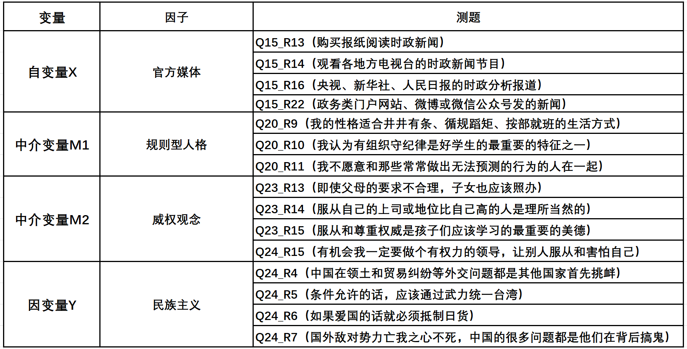

# 数据概况 {#usage}

```{r setup, include=FALSE}
knitr::opts_chunk$set(echo = TRUE)
##library(tidyverse) # Wickham的数据整理的整套工具
pdf.options(height=10/2.54, width=10/2.54, family="GB1") # 注意：此设置要放在最后
```

## 数据预处理 {#usage-ins}
   
### 变量选取与缺失值处理 {#usage-ons}
   
Amos无法对原始数据进行管理，一般情况下需要先用数据管理软件进行预处理。例如stata、spss和R语言。

这里我们先用stata挑选出了感兴趣的观测变量，并使用最简单的缺失值处理方法：删除所有作为缺失值的观测样本。

```{r}
# 注：以下为stata的代码格式，不可在R中使用！
# keep Q15_R13 Q15_R14 Q15_R16 Q15_R22 ///官方媒体
# Q20_R9 Q20_R10 Q20_R11 ///规则型人格
# Q23_R13 Q23_R14 Q23_R15 Q24_R15 ///威权观念
# Q24_R4 Q24_R5 Q24_R6 Q24_R7 

# save //需要保存后才能统一删除行缺失值

# dropmiss, obs any //删除挑选变量中所有的缺失值

# count //查看剩下多少样本量
```

原始数据的样本量一共为2379，进行特定变量的筛选并统一删除缺失值后，还剩下2149，数据缺失率为9.67%。

以下R的代码是将外部图片插入到Rmd文件中，picture是在大项目中的存放图形的子文件夹，按这样的格式插入即可。

```{r fig.cap="variable consequence"}

```
   
以上为各测题及以它们为基础构建的因子。由于结构方程模型进行的是验证性因子分析，故已预设我们选取了需要的因子及其测题。   

一般而言是通过以下两种方式：    

>1. 使用SPSS进行探索性因子分析
>2. 具有强力的理论支撑

为方便数据展示，现在导入R语言中查看数据情况。我们直接以stata的格式导入。

```{r}
library(haven)
netizen <- read_stata("eman.dta")
print(netizen)
```

### 数据概况 {#usage-pns}
```{r include=FALSE}
library(tidyverse)
```

```{r}
library(skimr)
skimr::skim(netizen)
```


## 描述统计 {#usage-writing}

```{r include=FALSE}
library(ggthemes)
library(likert)
library(magrittr)
```

### 官方媒体 {#usage-writing1}
```{r echo=FALSE}
netizen$Q15_R13 <- factor(netizen$Q15_R13,
                         levels = c("1", "2", "3", "4"),
                         labels = c("几乎不使用","不经常使用","经常使用","几乎每天使用"),
                         ordered = TRUE)
netizen$Q15_R14 <- factor(netizen$Q15_R14,
                         levels = c("1", "2", "3", "4"),
                         labels = c("几乎不使用","不经常使用","经常使用","几乎每天使用"),
                         ordered = TRUE)
netizen$Q15_R16 <- factor(netizen$Q15_R16,
                         levels = c("1", "2", "3", "4"),
                         labels = c("几乎不使用","不经常使用","经常使用","几乎每天使用"),
                         ordered = TRUE)
netizen$Q15_R22 <- factor(netizen$Q15_R22,
                         levels = c("1", "2", "3", "4"),
                         labels = c("几乎不使用","不经常使用","经常使用","几乎每天使用"),
                         ordered = TRUE)
```

```{r echo=FALSE}
officalmedia <- netizen %>% 
  select(
    "报纸阅读时政"=Q15_R13,
    "地方电视台新闻时政"=Q15_R14,
    "央视、新华社、人民日报"=Q15_R16,
    "政务类门户网站"=Q15_R22
  )
```

```{r echo=FALSE}
likert(as.data.frame(officalmedia)) %>%
  plot(type = "bar")
```
    
由上图可看出，调查人群使用官方媒体的频次较低的人数要多于使用频次较高的人。    
    
### 规则型人格 {#usage-writing2}
```{r echo=FALSE}
netizen$Q20_R9 <- factor(netizen$Q20_R9,
                         levels = c("1", "2", "3", "4","5"),
                         labels = c("很不符合","不太符合","中间或不确定","比较符合","非常符合"),
                         ordered = TRUE)
netizen$Q20_R10 <- factor(netizen$Q20_R10,
                         levels = c("1", "2", "3", "4","5"),
                         labels = c("很不符合","不太符合","中间或不确定","比较符合","非常符合"),
                         ordered = TRUE)
netizen$Q20_R11 <- factor(netizen$Q20_R11,
                         levels = c("1", "2", "3", "4","5"),
                         labels = c("很不符合","不太符合","中间或不确定","比较符合","非常符合"),
                         ordered = TRUE)
```

```{r echo=FALSE}
charter <- netizen %>% 
  select(
    "我适合井井有条、循规蹈矩、按部就班的生活"=Q20_R9,
    "我认为有组织守纪律是好学生最重要的特征之一"=Q20_R10,
    "我不愿和常常做出无法预测行为的人在一起"=Q20_R11
  )
```

```{r echo=FALSE}
likert(as.data.frame(charter)) %>%
  plot(type = "bar")
```
   
由上图可看出，调查人群中自我规则服从性认可度高的人数明显多于认可度的人数。
   
### 威权观念 {#usage-writing3}
```{r echo=FALSE}
netizen$Q23_R13 <- factor(netizen$Q23_R13,
                         levels = c("1", "2", "3", "4","5"),
                         labels = c("强烈反对","反对","中立","同意","非常同意"),
                         ordered = TRUE)
netizen$Q23_R14 <- factor(netizen$Q23_R14,
                         levels = c("1", "2", "3", "4","5"),
                         labels = c("强烈反对","反对","中立","同意","非常同意"),
                         ordered = TRUE)
netizen$Q23_R15 <- factor(netizen$Q23_R15,
                         levels = c("1", "2", "3", "4","5"),
                         labels = c("强烈反对","反对","中立","同意","非常同意"),
                         ordered = TRUE)
netizen$Q24_R15 <- factor(netizen$Q24_R15,
                         levels = c("1", "2", "3", "4","5"),
                         labels = c("强烈反对","反对","中立","同意","非常同意"),
                         ordered = TRUE)
```

```{r echo=FALSE}
forcerule <- netizen %>% 
  select(
    "父母要求不合理子女也要照办"=Q23_R13,
    "服从上司或地位高于自己的人理所当然"=Q23_R14,
    "服从和尊重权威是孩子应学的最重要品德"=Q23_R15,
    "有机会我一定做有权力领导，让他人服从和害怕"=Q24_R15
  )
```

```{r echo=FALSE}
likert(as.data.frame(forcerule)) %>%
  plot(type = "bar")
```

由上图可看出，调查人群中威权观念较弱的人数多于威权观念较强的人。    
    
### 民族主义 {#usage_writing4}
```{r echo=FALSE}
netizen$Q24_R4 <- factor(netizen$Q24_R4,
                         levels = c("1", "2", "3", "4","5"),
                         labels = c("非常反对","反对","中立","同意","非常同意"),
                         ordered = TRUE)
netizen$Q24_R5 <- factor(netizen$Q24_R5,
                         levels = c("1", "2", "3", "4","5"),
                         labels = c("非常反对","反对","中立","同意","非常同意"),
                         ordered = TRUE)
netizen$Q24_R6 <- factor(netizen$Q24_R6,
                         levels = c("1", "2", "3", "4","5"),
                         labels = c("非常反对","反对","中立","同意","非常同意"),
                         ordered = TRUE)
netizen$Q24_R7 <- factor(netizen$Q24_R7,
                         levels = c("1", "2", "3", "4","5"),
                         labels = c("非常反对","反对","中立","同意","非常同意"),
                         ordered = TRUE)
```

```{r echo=FALSE}
nationalism <- netizen %>% 
  select(
    "中国的外交问题都是其他国家挑衅"=Q24_R4,
    "条件允许应武力统一台湾"=Q24_R5,
    "如果爱国就必须抵制日货"=Q24_R6,
    "国外敌对势力亡我之心不死"=Q24_R7
  )
```

```{r echo=FALSE}
likert(as.data.frame(nationalism)) %>%
  plot(type = "bar") +
  theme(panel.grid.minor.x = element_blank(),
        axis.text.y = element_text(size = 8,face = "bold"))
```
   
由上图可看出，调查人群中怀有民族主义的倾向比较明显。