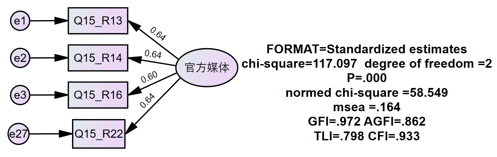
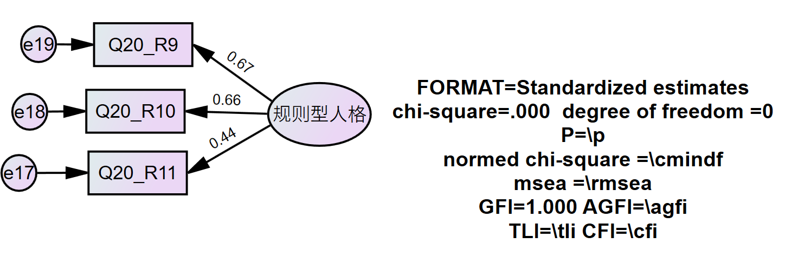
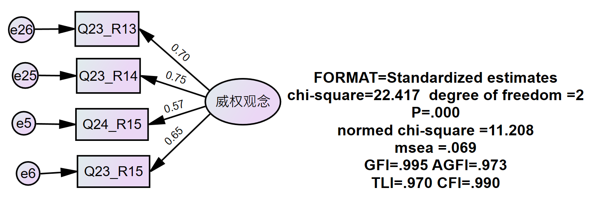
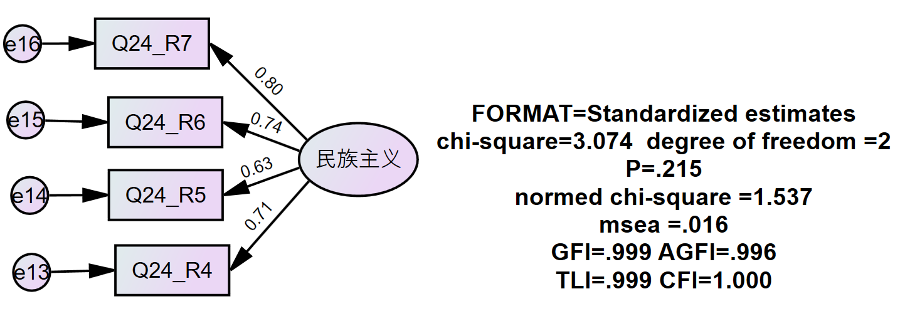
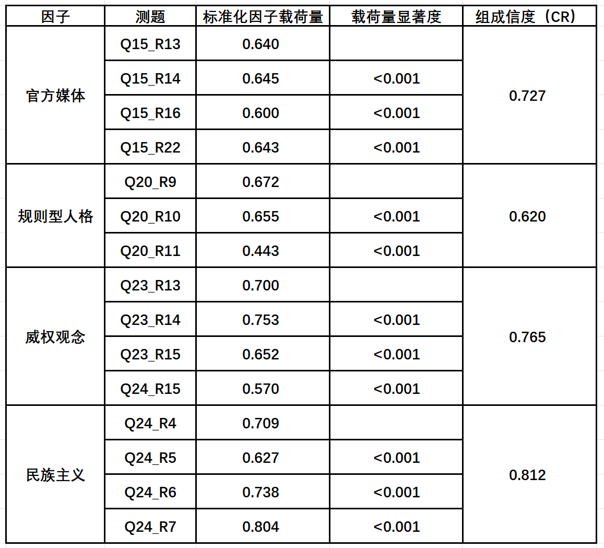
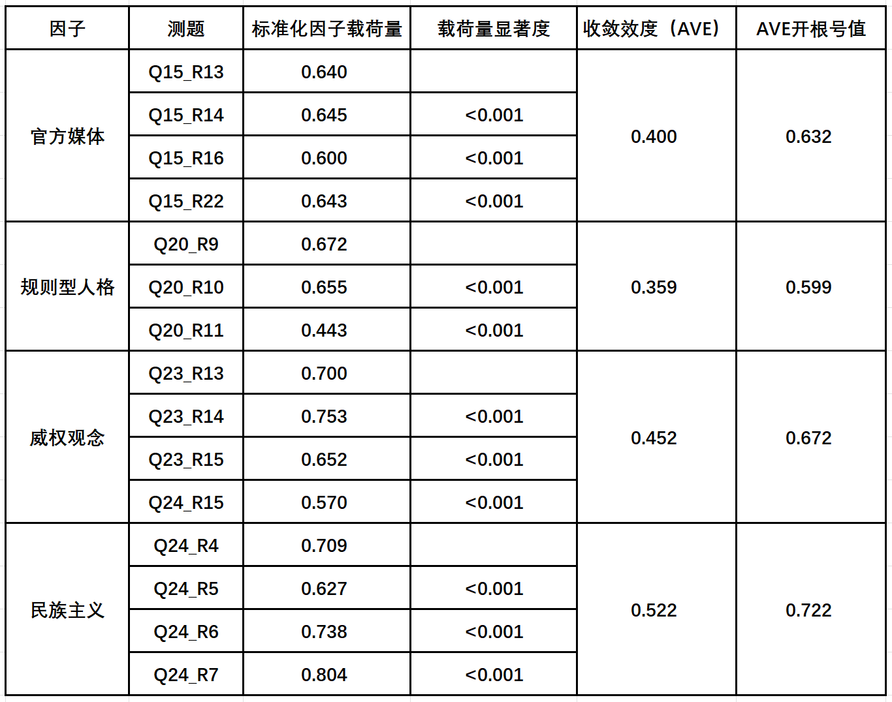
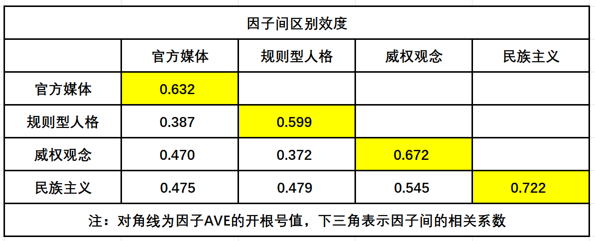

# 测量模型 {#obsmodel}

```{r setup, include=FALSE}
knitr::opts_chunk$set(echo = TRUE)
library(tidyverse) # Wickham的数据整理的整套工具
pdf.options(height=10/2.54, width=10/2.54, family="GB1") # 注意：此设置要放在最后
```

## 信度检验 {#obsmodel-intro}

### 参考标准 {#obsmodel-standar} 

选取和构造建构测量模型的观测变量和潜在变量后，根据以下几点参考标准，逐个对单独的测量模型进行检验。

> 1. 观测变量与潜在变量之间的非标准化回归系数(regression weight)
>    - 是否显著。   
    
> 2. 观测变量与潜在变量之间的标准化回归系数(standardized regression weight)
>    - 是否在(-1,1)之间，不在则存在共线性问题。   
>    - 标准化因子载荷量大小，参考值较好为0.7以上，宽松范围0.5以上。    
    
> 3. 模型绝对适配度（model fit），包括卡方值、卡方自由比、GFI、AGFI与Rmsea值     
>    - 卡方自由比范围：(1,3)，宽松范围(1,5)
>    - GFI参考范围：期望>0.90
>    - AGFI参考范围：期望>0.90
>    - Rmsea参考范围：期望<0.08，若介于0.08~0.10，模型适配度尚可

> 4. 变量的方差及残差是否为负数.

### 测量模型状况 {#obsmodel-situation}

#### 官方媒体测量模型情况 {-}
```{r fig.cap="obsmodel1"}

```
     
#### 规则型人格测量模型情况 {-}     
```{r fig.cap="obsmodel2"}

```
     
#### 威权观念测量模型情况 {-}
```{r fig.cap="obsmodel3"}

```
    
#### 民族主义测量模型情况 {-}
```{r fig.cap="obsmodel4"}

```

单个测量模型内非标准化系数都达到显著、标准化回归系数都在(-1,1)之间，方差和残差都为负，没有违反统计规律。个别测量模型标准化因子载荷量较低，卡方自由比较大，但总体都符合要求。
    
### 信度汇总 {#obsmodel-summary}

下一步计算各测量模型的组合信度如下表汇总。
```{r fig.cap="CR"}

```

各测量模型信度检验通过，下一步检验测量模型效度。

## 效度检验 {#obsmodel-def}
    
### 收敛效度 {#obsmodel-defa}  

各测量模型的收敛效度（平均变异数抽取量）如下表汇总，可使用计算出的收敛效度进一步求出其开根号值。收敛效度（平均变异数抽取量）的开根号值可反映潜变量（因子）与构建自身的测题的信息重合度。
```{r fig.cap="AVE"}

```
   
### 潜变量（因子）间相关性 {#obsmodel-defb}   

给各潜变量（因子）进行相关性检验。  

> 1. 检查潜变量（因子）之间是否具有共线性  

> 2. 进行潜变量（因子）之间的区别效度检验   

```{r fig.cap="correlation"}
knitr::include_graphics("picture/correlation.png")
```
     
### 区别效度 {#obsmodel-defc}
基于收敛效度与潜变量（因子）之间的相关性，可得出潜变量（因子）之间区别效度的情况，列出表格如下。
```{r fig.cap="discriminant validity"}

```

各测量模型组成信度、收敛效度与区别效度通过，测量模型检验通过，可建构结构模型。

