# 结构模型 {#strumodel}

```{r setup, include=FALSE}
knitr::opts_chunk$set(echo = TRUE)
library(tidyverse) # Wickham的数据整理的整套工具
pdf.options(height=10/2.54, width=10/2.54, family="GB1") # 注意：此设置要放在最后
```

## 研究假设 {#strumodel-one}

测量模型通过以后，以**“官方媒体”**作为自变量，**“规则型人格”**与**“威权观念”**作为中介变量，**“民族主义”**作为因变量，我们提出以下四点假设。  

> 1. **官方媒体的使用对民族主义的形成具有促进作用。**
> 2. **官方媒体的使用会塑造规则型人格，进而促进民族主义的形成。**
> 3. **官方媒体的使用会加强威权观念，进而促进民族主义的形成。** 
> 4. **官方媒体的使用会塑造规则型人格，规则型人格更容易形成威权观念，最终促进民族主义的形成**
 
若假设1与假设4成立，可构建从**“官方媒体”**到**“民族主义”**的远程中介（链式中介），下面将逐一对四个假设进行检验。
由于最终需要构建具有中介的结构方程模型，故做出以下补充：  

> - 在假设2中还会检验“官方媒体”对“规则型人格”的直接影响和“规则型人格”对“民族主义”的直接影响。
> - 在假设3中还会检验“官方媒体”对“威权观念”的直接影响”和“威权观念”对“民族主义”的直接影响。
> - 在假设4中还会检验“规则型人格”对“威权观念”的直接影响。   

以下检验只看变量之间的影响是否具有显著性，中介效果检验见下一章。
 
### 假设1 {#hypothesis1}

#### A.“官方媒体”-“民族主义” {-}
```{r fig.cap="officalmedia-nationalism"}
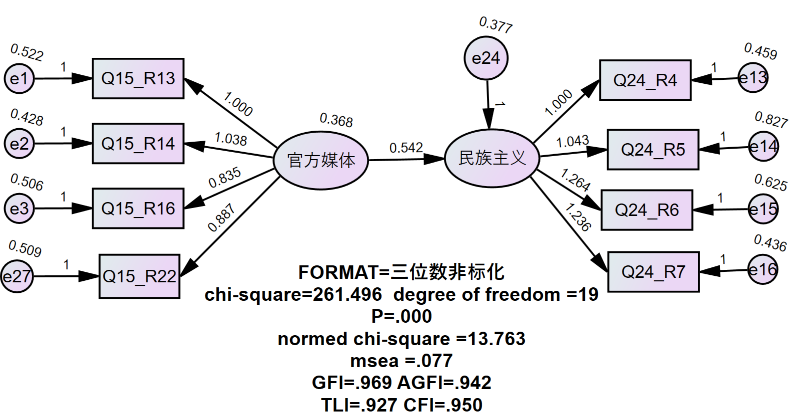
```  

**“官方媒体”对“民族主义”有显著的正向影响。**

> **假设1通过**     

### 假设2 {#hypothesis2}

> 假设2验证3条路径的显著性，先验证直接的2条路径，再验证含有中介的1条路径（假设2本身）。

#### B.“官方媒体”-“规则型人格” {-}
```{r fig.cap="officalmedia-Obedient personality"}
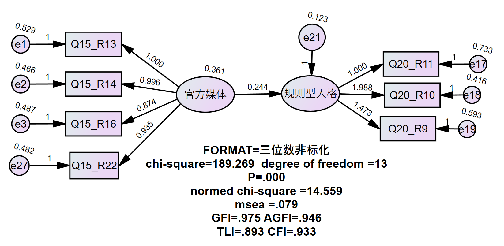
```   

**“官方媒体”对“规则型人格”具有显著的正向影响作用。**

#### C.“规则型人格”-“民族主义” {-}
```{r fig.cap="Obedient-nationalism"}
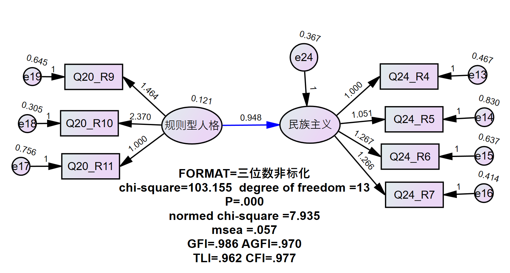
```   

**“官方媒体”对“规则型人格”具有显著的正向影响作用。**

#### D.“官方媒体”-“规则型人格”-“民族主义”，**(Bookstrap:5000,95%)** {-}
```{r fig.cap="officalmedia-Obedient personality-nationalism"}
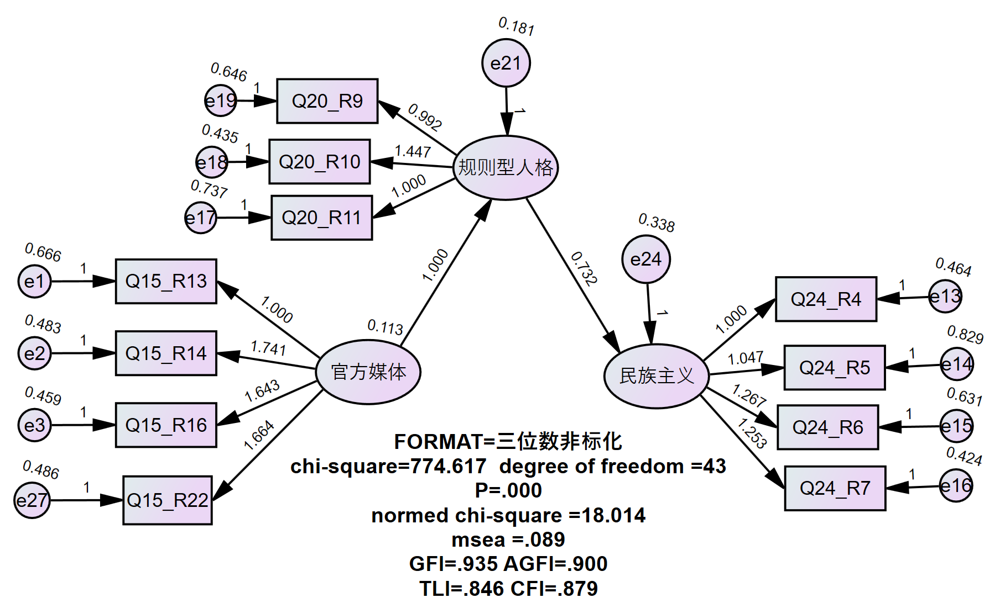
```    

**“官方媒体”经过“规则型人格”后，对“民族主义”具有显著的正向影响作用。**

> **假设2通过**

### 假设3 {#hypothesis3}

> 假设3同样验证3条路径的显著性，先验证直接的2条路径，再验证含有中介的1条路径（假设3本身）。

#### E.“官方媒体”-“威权观念” {-}
```{r fig.cap="officalmedia-authoritarianism"}
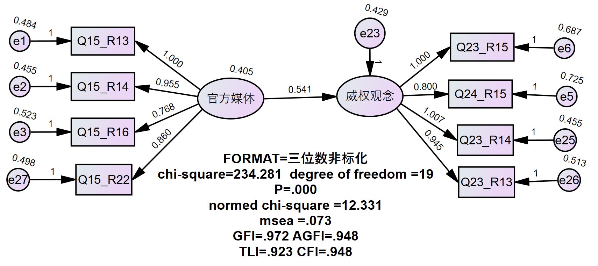
```    

**“官方媒体”对“威权观念”具有显著的正向影响作用。**

#### F.“威权观念”-“民族主义” {-}
```{r fig.cap="authoritarianism-nationalism"}
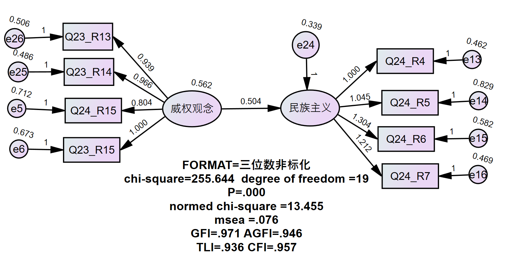
```    

**“威权观念”对“民族主义”具有显著的正向影响作用。**

#### G.“官方媒体”-“威权观念”-“民族主义”，**(Bookstrap:5000,95%)** {-}
```{r fig.cap="officalmedia-authoritarianism-nationalism"}
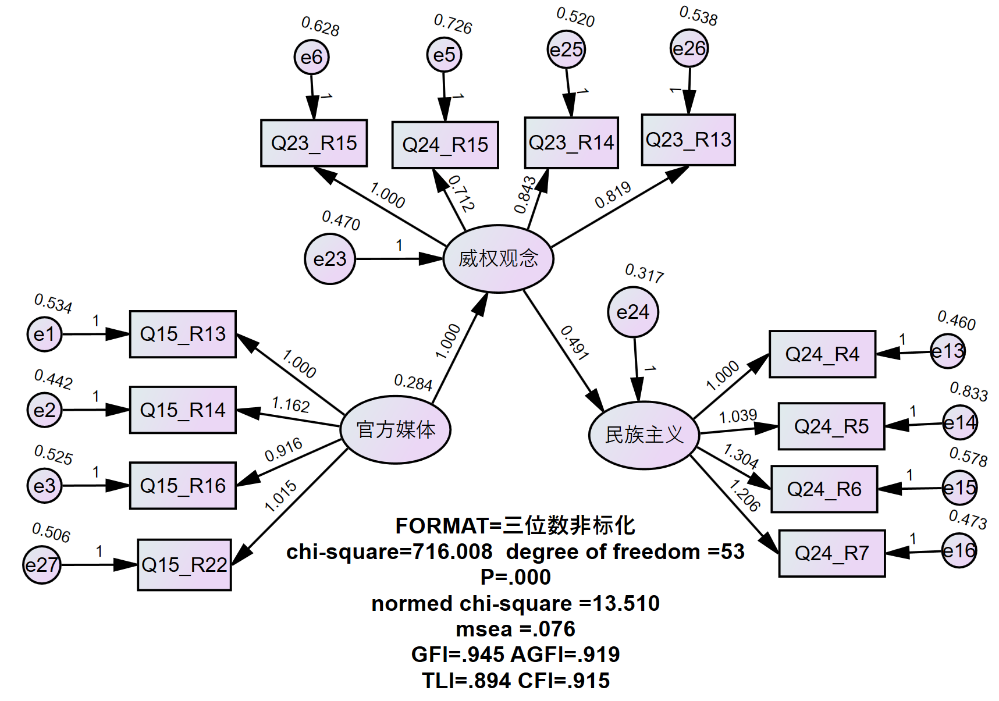
```    

**“官方媒体”经过“威权观念”后，对“民族主义”具有显著的正向影响作用。**

> **假设3通过**

### 假设4 {#hypothesis4}

> 假设4先验证“规则型人格”对“威权观念”的影响显著性，接着验证远程中介路径“官方媒体”-“规则型人格”-“威权人格”-“民族主义”路径的显著性。

#### H.“规则型人格”-“威权观念” {-}
```{r fig.cap="Obedient personality-authoritarianism"}
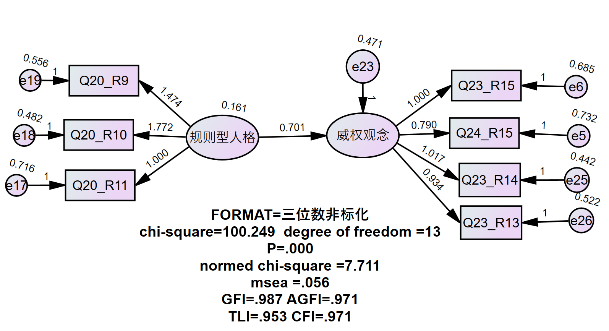
```    

**“规则型人格”对“威权观念”具有显著的正向影响作用。**

#### I.“官方媒体”-“规则型人格”-“威权观念”-“民族主义”，**(Bookstrap:5000,95%)** {-}
```{r fig.cap="officalmedia-Obedient personality-authoritarianism-nationalism"}
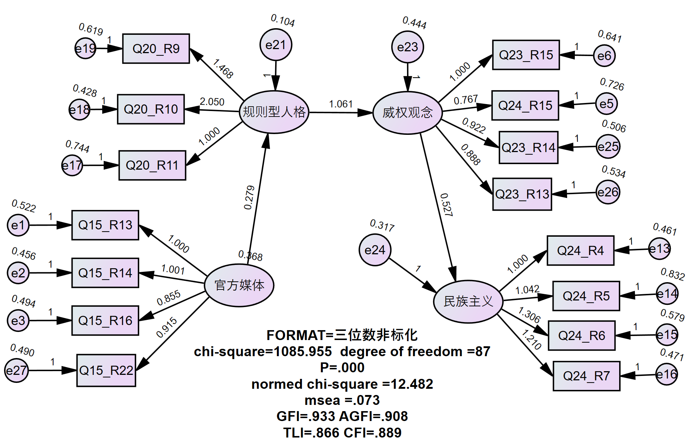
```    

**“官方媒体”影响“规则型人格”，进而影响“威权观念”，最后影响“民族主义”的路径是显著的。**

> **假设4通过**    

## 理论视角 {#strumodel-xxx}
     
### 文献综述 {#strumodel-xxy}
    
根据我们的研究思路与所选变量，确定研究对象为“民族主义”，研究内容是“民族主义”在官方媒体话语与宣传的作用下的形成机制，研究的目的在于验证民族主义是否由官方媒体塑造，并分析在官方媒体话语宣传到民族主义的形成过程中存在的相关影响因素，例如官方对公众自上而下的意识规训，公众在与国家的对话中如何被塑造成期望的合格公民，最后反思国家治理中话语的权力渗透与国民意识形成的关系。基于此，我们对前人的研究进行了相关梳理。
    
在国家形象与国家权威塑造方面，马得勇、陆屹洲（2022）对于国家形象的心理分析，重点考察了美国受访者对中国好感度和中国受访者对美国好感度及其影响因素,同时也分析了两国受访者对日本、俄罗斯、朝鲜三个重要国家的好感度,从而分析这三国的国家形象及影响因素。研究结果表明,虽然媒体信息接触、政治知识或信 息储备对个体有一定的影响,但国家形象仍然具有稳定的、差异化的政治心理基础。特别地,个体的基本政治认知图式会和国家形象产生明显的匹配效应,即偏爱集体主义/个人主义价值的民众会更喜欢崇尚集体主义/个人主义的国家。   

在宏观民族主义研究方面，秦在东、陶丽（2023）对于我国网络民族主义的研究探索从“民族主义网络化”到“网络民 族主义”的历程；王坚方（2001）分析了信息网络时代下，文化帝国主义与民族主义之间的博弈，提出“文化自觉需要理性的反文化”，“要善于利用和合思想化解价值冲突”的观点；周明（2002）在论述“原始黑 客精神”时谈到“中国黑客有着较为浓烈的民族主义色彩”，其中还罗列了中国黑客曾经参与过的一些重大的网络民族主义事件，同时指出黑客往往与极端民族主义活动相联系。   

在微观民族主义研究方面，卜建华（2008--2018）从思想政治教育学科的角度分别论述了中国网络民族主义的思想政治教育功能、意识形态功能、政治参与功能，对青年政治社会化的影响、对中国外交的影响，以及对极端网络民族主义倾向与行为的批判，并对青年学生参与网络民族主义的参与方式与疏导策略进行了论述。在网络民族主义与国家权威联系来看，卜建华（2012）认为中国网络民族主义的积极影响在于有利于在全球化浪潮中维护国家利益，促成民族的发展，有利于经济发展和社会进步；消极影响在于网络民族主义一旦偏激，容易走向极端或不理性的沙文民族主义，甚至会在全球引发动荡不安，导致种族冲突、种族灭绝的历史性悲剧；葛素华认为其积极影响主要表现在增强民族凝聚力和向心力进而维护国家安全、提升民众政治参与度进而推动民主化进程、维护民族利益和国家形象上，而消极影响则体现在极端偏激的网络民族主义可能给主流意识形态安全、社会稳定与政治安全以及我国的国际形象带来不小的挑战。

本研究受马得勇教授《信息接触、威权人格、意识形态与网络民族主义—————中国网民政治态度形成机制分析》文章启发，基于实证数据的分析，发现既有研究往往在数据分析的过程中忽视了变量间的共线性与相关统计学规律，预设的理论导向过强，与根据数据建构的模型差异较为明显。在前人研究的理论基础上，我们根据模型要求对变量的选取和关系建构进行了进一步的调整。

## 模型建构 {#strumodel-two}

通过四个假设以后以及各路径的显著性检验后，接下来进行远程中介（链式中介）模型的建构，验证“官方媒体-规则型人格-威权观念-民族主义”这一远程中介路径是否显著存在。

```{r fig.cap="SEM"}
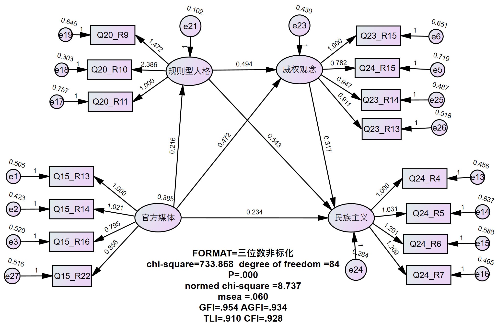
```   

**模型的卡方自由比为8.737，Rmsea为0.060，GFI为0.954，AGFI为0.934，绝对适配度总体符合要求。**

```{r fig.cap="p"}
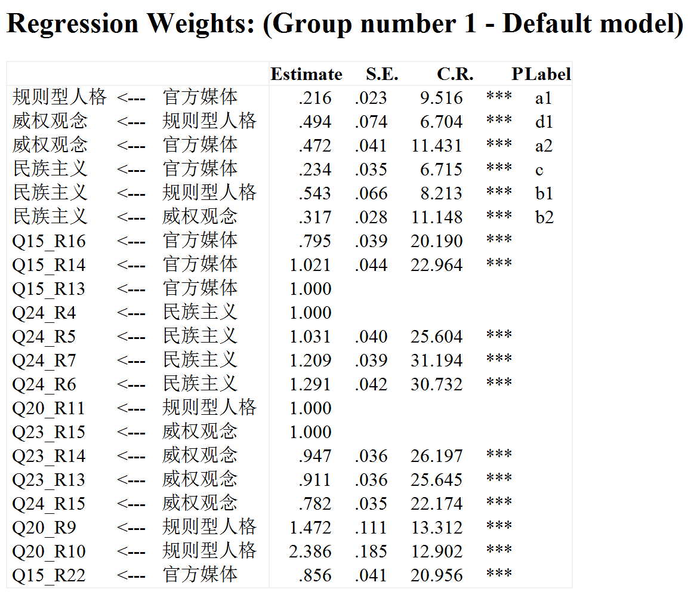
```  

**模型中各路径系数显著，且方差、残差不为负，因子间不存在共线性，整体模型符合要求。**
