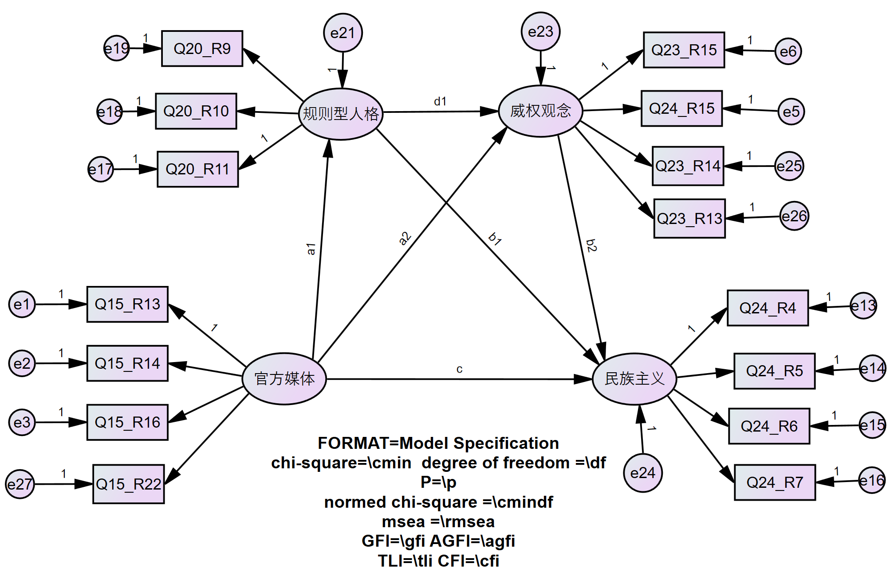
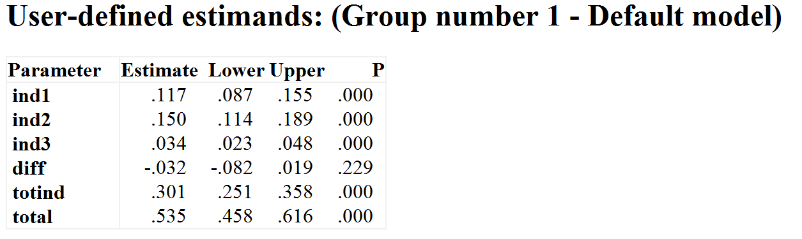
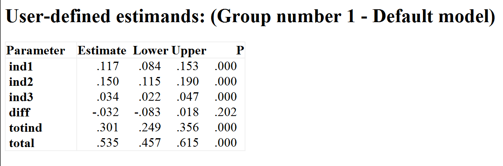
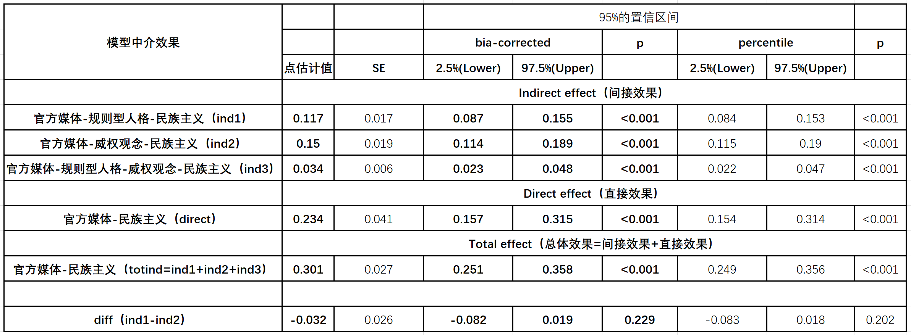

# 中介效果检验 {#mediator}

```{r setup, include=FALSE}
knitr::opts_chunk$set(echo = TRUE)
library(tidyverse) # Wickham的数据整理的整套工具
pdf.options(height=10/2.54, width=10/2.54, family="GB1") # 注意：此设置要放在最后
```

## 远程中介的效果检验 {#mediator-station}

### 操作 {#mediator-method}
中介模型建立以后，一般通过Bookstrap查看其直接效果和间接效果在Bias-corrected percentile method和Percentile method的区间情况和显著度。<u>若为简单的双中介模型，首先需要确认总中介效果是否显著；若是远程中介（链式中介），则首先需要确认远程中介效果是否显著。</u>

为方便解读输出结果，现给每一条路径标记。

```{r fig.cap="path_label"}

```    

在User-defined estimand中，进行如下设置。   
  
> * ind1 = a1 * b1 **第一个中介“规则型人格”的中介效应**
> * ind2 = a2 * b2 **第二个中介“威权观念”的中介效应**
> * diff = ind1 - ind2 **ind2与ind3两个中介影响是否有差异**
> * ind3 = a1 * d1 * b2 **远程中介效应**
> * totind = ind1 + ind2 + ind3 **总中介效应**
> * total = c + totind **总效应**

### 解读 {#mediator-state}

Bias-corrected percentile method
```{r fig.cap="User-defined_bias"}

```

Percentile method
```{r fig.cap="User-defined_percentile"}

```

直接路径需要单独看，在此不赘述，汇成总表如下：
```{r fig.cap="mediator_effects"}

```

由汇总表格可以看出，远程中介模型中，直接效应点估计值为0.234，并且显著；远程中介效应点估计值为0.034，并且显著；中介路径ind1与中介路径ind2的点估计值分别为0.117和0.150，并且都显著；总中介效应点估计值为0.301，并且显著。其中，中介路径ind1与ind2并不存在显著差异，两条路径对民族主义影响没有差异。
综上，“规则型人格”和“威权观念”在影响“民族主义”的路径中，起着显著的远程中介效应，中介效果点估计值IE=0.034，SE为0.006。

