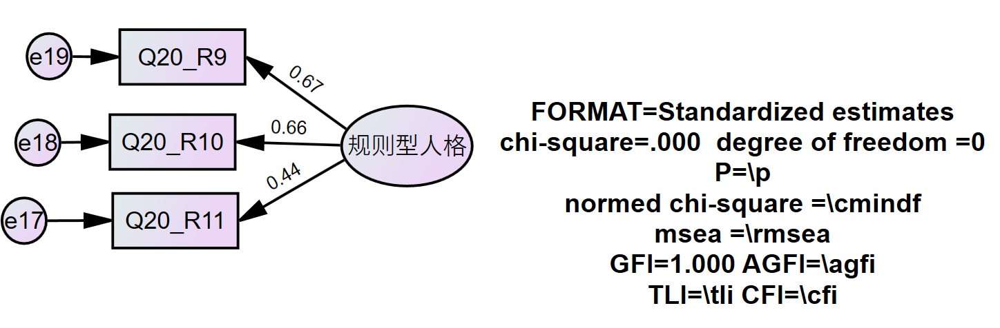
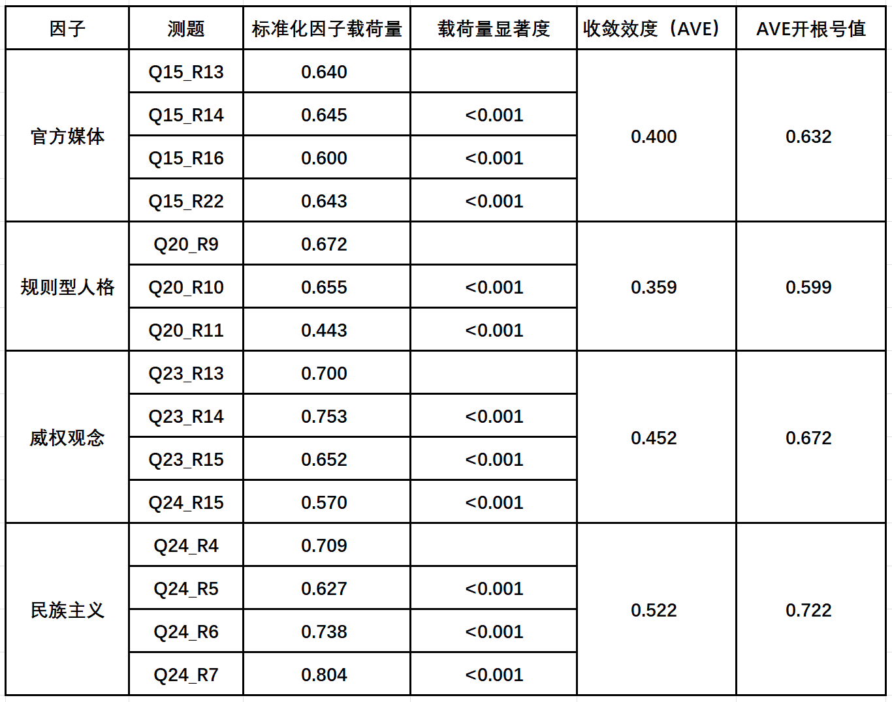

# 测量模型 {#obsmodel}


## 信度检验 {#obsmodel-intro}

### 参考标准 {#obsmodel-standar} 

选取和构造建构测量模型的观测变量和潜在变量后，根据以下几点参考标准，逐个对单独的测量模型进行检验。

> 1. 观测变量与潜在变量之间的非标准化回归系数(regression weight)
>    - 是否显著。   
    
> 2. 观测变量与潜在变量之间的标准化回归系数(standardized regression weight)
>    - 是否在(-1,1)之间，不在则存在共线性问题。   
>    - 标准化因子载荷量大小，参考值较好为0.7以上，宽松范围0.5以上。    
    
> 3. 模型绝对适配度（model fit），包括卡方值、卡方自由比、GFI、AGFI与Rmsea值     
>    - 卡方自由比范围：(1,3)，宽松范围(1,5)
>    - GFI参考范围：期望>0.90
>    - AGFI参考范围：期望>0.90
>    - Rmsea参考范围：期望<0.08，若介于0.08~0.10，模型适配度尚可

> 4. 变量的方差及残差是否为负数.

### 测量模型状况 {#obsmodel-situation}

#### 官方媒体测量模型情况 {-}

```r
knitr::include_graphics("picture/obsmodel1.png")
```

<div class="figure">

<p class="caption">(\#fig:unnamed-chunk-1)obsmodel1</p>
</div>
     
#### 规则型人格测量模型情况 {-}     

```r

```

<div class="figure">

<p class="caption">(\#fig:unnamed-chunk-2)obsmodel2</p>
</div>
     
#### 威权观念测量模型情况 {-}

```r
knitr::include_graphics("picture/obsmodel3.png")
```

<div class="figure">

<p class="caption">(\#fig:unnamed-chunk-3)obsmodel3</p>
</div>
    
#### 民族主义测量模型情况 {-}

```r
knitr::include_graphics("picture/obsmodel4.png")
```

<div class="figure">

<p class="caption">(\#fig:unnamed-chunk-4)obsmodel4</p>
</div>

单个测量模型内非标准化系数都达到显著、标准化回归系数都在(-1,1)之间，方差和残差都为负，没有违反统计规律。个别测量模型标准化因子载荷量较低，卡方自由比较大，但总体都符合要求。
    
### 信度汇总 {#obsmodel-summary}

下一步计算各测量模型的组合信度如下表汇总。

```r

```

<div class="figure">

<p class="caption">(\#fig:unnamed-chunk-5)CR</p>
</div>

各测量模型信度检验通过，下一步检验测量模型效度。

## 效度检验 {#obsmodel-def}
    
### 收敛效度 {#obsmodel-defa}  

各测量模型的收敛效度（平均变异数抽取量）如下表汇总，可使用计算出的收敛效度进一步求出其开根号值。收敛效度（平均变异数抽取量）的开根号值可反映潜变量（因子）与构建自身的测题的信息重合度。

```r

```

<div class="figure">

<p class="caption">(\#fig:unnamed-chunk-6)AVE</p>
</div>
   
### 潜变量（因子）间相关性 {#obsmodel-defb}   

给各潜变量（因子）进行相关性检验。  

> 1. 检查潜变量（因子）之间是否具有共线性  

> 2. 进行潜变量（因子）之间的区别效度检验   


```r

```

<div class="figure">

<p class="caption">(\#fig:unnamed-chunk-7)correlation</p>
</div>
     
### 区别效度 {#obsmodel-defc}
基于收敛效度与潜变量（因子）之间的相关性，可得出潜变量（因子）之间区别效度的情况，列出表格如下。

```r
knitr::include_graphics("picture/discriminant validity.png")
```

<div class="figure">

<p class="caption">(\#fig:unnamed-chunk-8)discriminant validity</p>
</div>

各测量模型组成信度、收敛效度与区别效度通过，测量模型检验通过，可建构结构模型。

