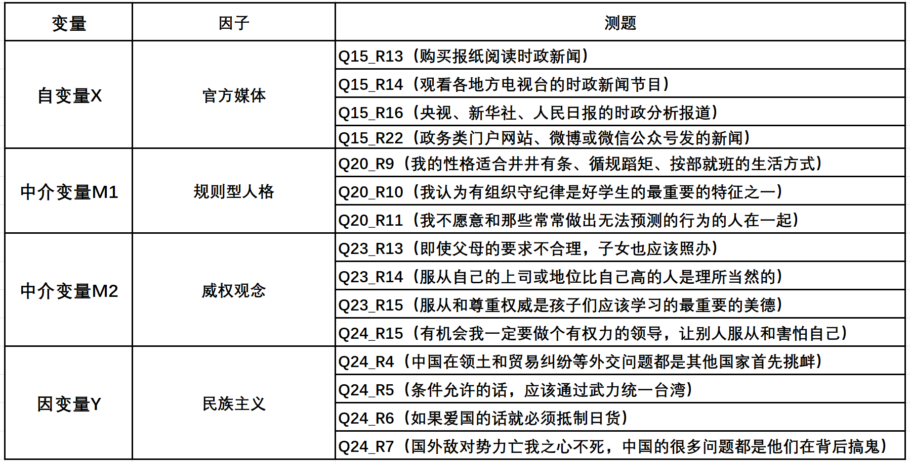
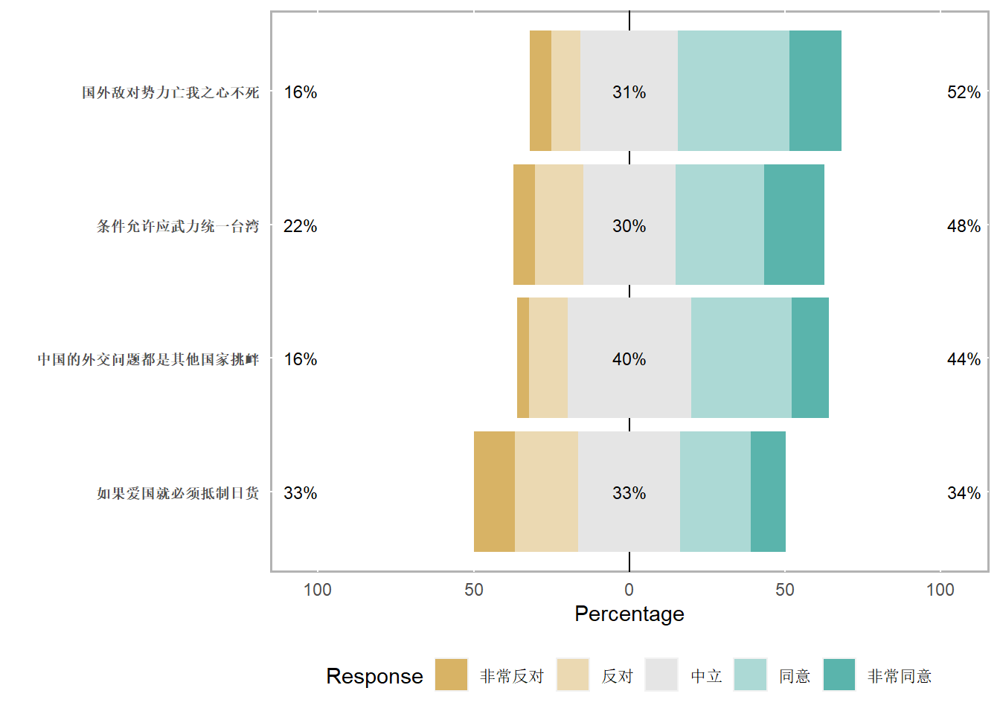

# 数据概况 {#usage}


## 数据预处理 {#usage-ins}
   
### 变量选取与缺失值处理 {#usage-ons}
   
Amos无法对原始数据进行管理，一般情况下需要先用数据管理软件进行预处理。例如stata、spss和R语言。

这里我们先用stata挑选出了感兴趣的观测变量，并使用最简单的缺失值处理方法：删除所有作为缺失值的观测样本。


```r
# 注：以下为stata的代码格式，不可在R中使用！
# keep Q15_R13 Q15_R14 Q15_R16 Q15_R22 ///官方媒体
# Q20_R9 Q20_R10 Q20_R11 ///规则型人格
# Q23_R13 Q23_R14 Q23_R15 Q24_R15 ///威权观念
# Q24_R4 Q24_R5 Q24_R6 Q24_R7 

# save //需要保存后才能统一删除行缺失值

# dropmiss, obs any //删除挑选变量中所有的缺失值

# count //查看剩下多少样本量
```

原始数据的样本量一共为2379，进行特定变量的筛选并统一删除缺失值后，还剩下2149，数据缺失率为9.67%。

以下R的代码是将外部图片插入到Rmd文件中，picture是在大项目中的存放图形的子文件夹，按这样的格式插入即可。


```r

```

<div class="figure">

<p class="caption">(\#fig:unnamed-chunk-2)variable consequence</p>
</div>
   
以上为各测题及以它们为基础构建的因子。由于结构方程模型进行的是验证性因子分析，故已预设我们选取了需要的因子及其测题。   

一般而言是通过以下两种方式：    

>1. 使用SPSS进行探索性因子分析
>2. 具有强力的理论支撑

为方便数据展示，现在导入R语言中查看数据情况。我们直接以stata的格式导入。


```r
library(haven)
netizen <- read_stata("eman.dta")
print(netizen)
```

```
## # A tibble: 2,149 × 15
##    Q15_R13       Q15_R14 Q15_R16 Q15_R22 Q20_R9  Q20_R10 Q20_R11 Q23_R13 Q23_R14
##    <dbl+lbl>     <dbl+l> <dbl+l> <dbl+l> <dbl+l> <dbl+l> <dbl+l> <dbl+l> <dbl+l>
##  1 1 [几乎不使… 3 [经… 3 [经… 4 [几… 5 [非… 4 [比… 4 [比… 1 [强… 2 [反…
##  2 1 [几乎不使… 1 [几… 2 [不… 1 [几… 4 [比… 3 [中… 4 [比… 3 [中… 3 [中…
##  3 4 [几乎每天… 4 [几… 4 [几… 4 [几… 3 [中… 3 [中… 3 [中… 3 [中… 3 [中…
##  4 3 [经常使用]… 3 [经… 3 [经… 3 [经… 4 [比… 4 [比… 4 [比… 4 [同… 4 [同…
##  5 2 [不常使用]… 3 [经… 3 [经… 2 [不… 4 [比… 4 [比… 2 [不… 4 [同… 4 [同…
##  6 1 [几乎不使… 1 [几… 1 [几… 1 [几… 1 [很… 3 [中… 5 [非… 3 [中… 3 [中…
##  7 4 [几乎每天… 3 [经… 3 [经… 3 [经… 3 [中… 4 [比… 3 [中… 4 [同… 3 [中…
##  8 2 [不常使用]… 2 [不… 2 [不… 2 [不… 4 [比… 4 [比… 4 [比… 2 [反… 3 [中…
##  9 2 [不常使用]… 2 [不… 3 [经… 3 [经… 4 [比… 4 [比… 2 [不… 1 [强… 2 [反…
## 10 3 [经常使用]… 3 [经… 4 [几… 3 [经… 4 [比… 5 [非… 3 [中… 3 [中… 4 [同…
## # ℹ 2,139 more rows
## # ℹ 6 more variables: Q23_R15 <dbl+lbl>, Q24_R4 <dbl+lbl>, Q24_R5 <dbl+lbl>,
## #   Q24_R6 <dbl+lbl>, Q24_R7 <dbl+lbl>, Q24_R15 <dbl+lbl>
```

### 数据概况 {#usage-pns}


```r
library(skimr)
skimr::skim(netizen)
```


Table: (\#tab:unnamed-chunk-5)Data summary

|                         |        |
|:------------------------|:-------|
|Name                     |netizen |
|Number of rows           |2149    |
|Number of columns        |15      |
|_______________________  |        |
|Column type frequency:   |        |
|numeric                  |15      |
|________________________ |        |
|Group variables          |None    |


**Variable type: numeric**

|skim_variable | n_missing| complete_rate| mean|   sd| p0| p25| p50| p75| p100|hist  |
|:-------------|---------:|-------------:|----:|----:|--:|---:|---:|---:|----:|:-----|
|Q15_R13       |         0|             1| 2.07| 0.94|  1|   1|   2|   3|    4|▇▇▁▆▂ |
|Q15_R14       |         0|             1| 2.43| 0.91|  1|   2|   2|   3|    4|▃▇▁▇▂ |
|Q15_R16       |         0|             1| 2.59| 0.87|  1|   2|   3|   3|    4|▂▆▁▇▃ |
|Q15_R22       |         0|             1| 2.36| 0.89|  1|   2|   2|   3|    4|▃▇▁▇▂ |
|Q20_R9        |         0|             1| 3.41| 0.95|  1|   3|   4|   4|    5|▁▃▅▇▂ |
|Q20_R10       |         0|             1| 3.53| 0.99|  1|   3|   4|   4|    5|▁▂▃▇▂ |
|Q20_R11       |         0|             1| 3.41| 0.94|  1|   3|   4|   4|    5|▁▃▆▇▂ |
|Q23_R13       |         0|             1| 2.47| 1.00|  1|   2|   2|   3|    5|▂▇▅▂▁ |
|Q23_R14       |         0|             1| 2.70| 1.01|  1|   2|   3|   3|    5|▂▇▇▃▁ |
|Q23_R15       |         0|             1| 2.95| 1.11|  1|   2|   3|   4|    5|▃▆▇▇▂ |
|Q24_R4        |         0|             1| 3.36| 0.97|  1|   3|   3|   4|    5|▁▂▇▆▂ |
|Q24_R5        |         0|             1| 3.38| 1.16|  1|   3|   3|   4|    5|▂▅▇▇▅ |
|Q24_R6        |         0|             1| 2.99| 1.18|  1|   2|   3|   4|    5|▃▅▇▆▃ |
|Q24_R7        |         0|             1| 3.46| 1.08|  1|   3|   4|   4|    5|▂▂▇▇▃ |
|Q24_R15       |         0|             1| 2.59| 1.04|  1|   2|   3|   3|    5|▃▇▇▃▁ |


## 描述统计 {#usage-writing}


### 官方媒体 {#usage-writing1}


    
由上图可看出，调查人群使用官方媒体的频次较低的人数要多于使用频次较高的人。    
    
### 规则型人格 {#usage-writing2}


   
由上图可看出，调查人群中自我规则服从性认可度高的人数明显多于认可度的人数。
   
### 威权观念 {#usage-writing3}


由上图可看出，调查人群中威权观念较弱的人数多于威权观念较强的人。    
    
### 民族主义 {#usage_writing4}



   
由上图可看出，调查人群中怀有民族主义的倾向比较明显。
